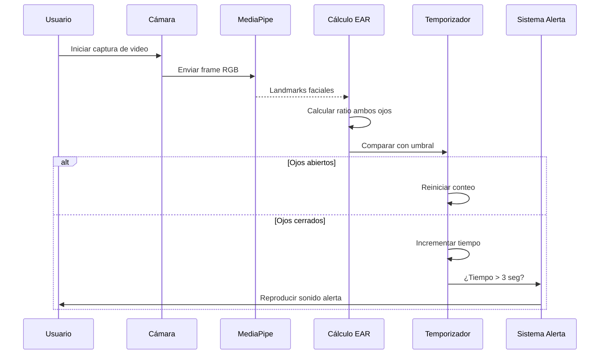

# Documento de Arquitectura - Fatigue Detector

## 1. Organigrama del Proyecto

```
Detector de Fatiga Ocular
├── Aplicación Principal (main.py)
│   ├── Módulos de Visión
│   │   ├── MediaPipe Face Mesh
│   │   │   └── Landmarks oculares
│   │   └── OpenCV (captura de video)
│   ├── Lógica de Detección
│   │   ├── Cálculo de EAR (Eye Aspect Ratio)
│   │   ├── Detección de ojos cerrados
│   │   └── Temporizador de fatiga
│   └── Sistema de Alertas
│       ├── Reproducción de sonido (pygame)
│       └── Visualización (OpenCV窗口)
│
└── Nodo n8n (src/)
    ├── FatigueDetector.node.ts
    │   ├── Configuración de parámetros
    │   ├── Modos de operación
    │   │   ├── Trigger
    │   │   ├── Data
    │   │   └── Monitor
    │   └── Detección (real/simulada)
    └── index.ts (punto de entrada)
```

## 2. Arquitectura del Sistema

```mermaid
flowchart TB
    subgraph "Componente Python Standalone"
        A[Cámara Web] --> B[OpenCV Capture]
        B --> C[MediaPipe Face Mesh]
        C --> D[Cálculo EAR]
        D --> E{¿Ojos cerrados?}
        E -->|Sí| F[Temporizador]
        E -->|No| G[Reiniciar temporizador]
        F --> H{¿Tiempo > umbral?}
        H -->|Sí| I[Reproducir Alerta]
        H -->|No| B
        Irar en --> J[Most ventana]
    end
    
    subgraph "Componente n8n"
        K[Webhook/Input] --> L[Fatigue Detector Node]
        L --> M[Modo Trigger]
        L --> N[Modo Data]
        L --> O[Modo Monitor]
        M --> P[Enviar Slack/Email]
        N --> Q[Devolver métricas]
        O --> R[Loguear estado]
    end
```

## 3. Flujo de Funcionamiento

### 3.1 Aplicación Python



### 3.2 Cálculo de Eye Aspect Ratio (EAR)

```
Landmarks del ojo izquierdo: [33, 160, 158, 133, 153, 144]
Landmarks del ojo derecho: [362, 385, 387, 263, 373, 380]

EAR = (|y₂ - y₆| + |y₃ - y₅|) / (2 × |x₁ - x₄|)

Donde:
- x₁, x₄ = puntos horizontales del ojo
- y₂, y₃, y₅, y₆ = puntos verticales del ojo

Umbral típico: 0.18 (valor por defecto)
```

## 4. Mockups de la Interfaz

### 4.1 Aplicación Python - Ventana de Detección

```
┌─────────────────────────────────────────────────────────────┐
│  Antigravity - Detección de ojos                           │
├─────────────────────────────────────────────────────────────┤
│                                                             │
│    ┌─────────────────────────────────────────────┐          │
│    │                                             │          │
│    │          [LIVE VIDEO FEED]                 │          │
│    │                                             │          │
│    │     ┌───●───┐  ← Indicador de mirada        │          │
│    │     │  (·)  │                               │          │
│    │     └───┴───┘                               │          │
│    │                                             │          │
│    └─────────────────────────────────────────────┘          │
│                                                             │
│  ┌─────────────────────────────────────────────────────┐    │
│  │ Estado: 🟢 NORMAL  |  EAR: 0.25  |  Tiempo: 0.0s  │    │
│  └─────────────────────────────────────────────────────┘    │
│                                                             │
│  ┌─────────────────────────────────────────────────────┐    │
│  │ [q] Salir  |  Umbral: 0.18  |  Límite: 3s         │    │
│  └─────────────────────────────────────────────────────┘    │
│                                                             │
└─────────────────────────────────────────────────────────────┘
```

### 4.2 Nodo n8n - Editor de Workflow

```
┌─────────────────────────────────────────────────────────────────────────┐
│  Fatigue Detector                                                     │
├─────────────────────────────────────────────────────────────────────────┤
│                                                                         │
│  Propiedades:                                                           │
│  ┌─────────────────────────────────────────────────────────────────┐   │
│  │ Eye Closed Threshold    [0.18                      ] (0.05-0.5) │   │
│  └─────────────────────────────────────────────────────────────────┘   │
│  ┌─────────────────────────────────────────────────────────────────┐   │
│  │ Closed Time Limit       [3                        ] (1-60) seg  │   │
│  └─────────────────────────────────────────────────────────────────┘   │
│  ┌─────────────────────────────────────────────────────────────────┐   │
│  │ Alert Mode              [▼ Trigger Workflow       ]              │   │
│  │                         [  Return Data Only       ]              │   │
│  │                         [  Monitor Only           ]              │   │
│  └─────────────────────────────────────────────────────────────────┘   │
│  ┌─────────────────────────────────────────────────────────────────┐   │
│  │ Camera Index            [0                        ]              │   │
│  └─────────────────────────────────────────────────────────────────┘   │
│  ┌─────────────────────────────────────────────────────────────────┐   │
│  │ Monitor Duration        [30                       ] (0-300) seg │   │
│  └─────────────────────────────────────────────────────────────────┘   │
│  ┌─────────────────────────────────────────────────────────────────┐   │
│  │ Return All Metrics     [☑]                                     │   │
│  └─────────────────────────────────────────────────────────────────┘   │
│                                                                         │
│  Entradas: [main]                                     Salidas: [main]   │
│                                                                         │
└─────────────────────────────────────────────────────────────────────────┘
```

### 4.3 Ejemplo de Workflow en n8n

```
┌─────────┐     ┌─────────────────┐     ┌─────────┐     ┌─────────────┐
│Webhook  │ ──▶ │ Fatigue Detector│ ──▶ │   IF    │ ──▶ │ Slack Alert │
│Trigger  │     │                 │     │ fatigue?│     │             │
└─────────┘     └─────────────────┘     └────┬────┘     └─────────────┘
                                            │
                                            ▼
                                     ┌─────────────┐
                                     │  Continue  │
                                     │   Normal   │
                                     └─────────────┘
```

## 5. Parámetros de Configuración

| Parámetro | Valor Defecto | Rango | Descripción |
|-----------|---------------|-------|-------------|
| Eye Closed Threshold | 0.18 | 0.05 - 0.5 | Umbral EAR para considerar ojo cerrado |
| Closed Time Limit | 3 segundos | 1 - 60 | Tiempo con ojos cerrados para activar alerta |
| Camera Index | 0 | 0+ | Índice de la cámara a usar |
| Monitor Duration | 30 segundos | 0 - 300 | Duración del monitoreo |

## 6. Salida de Datos

### Formato JSON (Modo Data)

```json
{
  "status": "alert",
  "fatigueDetected": true,
  "eyeAspectRatio": 0.15,
  "closedDuration": 3.5,
  "timestamp": "2024-01-15T10:30:00.000Z",
  "leftEyeRatio": 0.14,
  "rightEyeRatio": 0.16,
  "faceDetected": true
}
```

## 7. Dependencias del Proyecto

```
Python:
├── opencv-python >= 4.8.0
├── mediapipe >= 0.10.0
└── pygame >= 2.5.0

TypeScript (n8n):
├── n8n-workflow >= 1.0.0
├── opencv4nodejs >= 6.2.0
└── mediapipe >= 0.10.0
```
